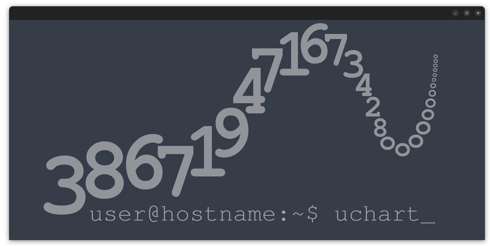
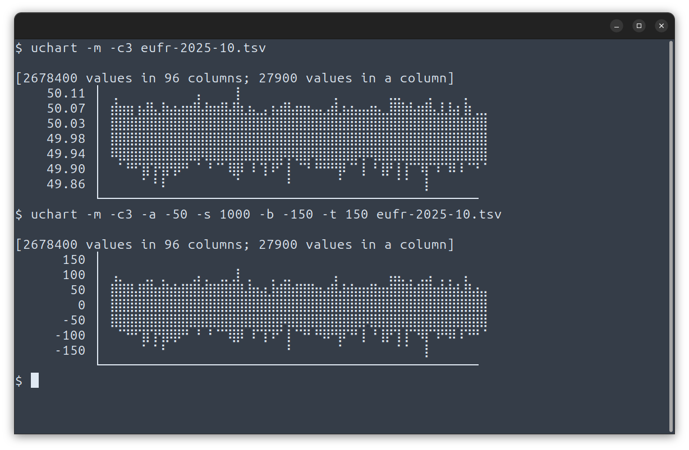
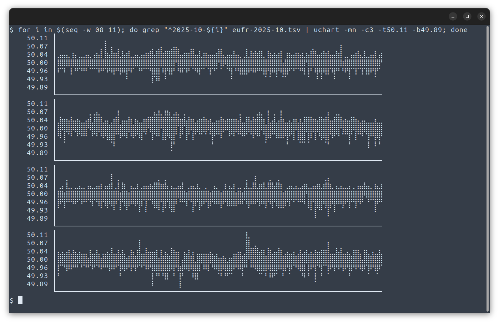

&emsp;&emsp;[install](#installation)&emsp;&emsp;[usage](#usage)

# <u>uChart</u>

**Uchart** is a zero-dependency, single-file Python script that instantly plots simple terminal charts from numeric data.

It reads data from **standard input (stdin)** or directly from one or more **files** given as positional arguments.  
You can also pass a filename pattern (shell glob/wildcard) – uchart will automatically use data from all matching files.

Terminal requirements: UTF-8 and Unicode support (standard in all modern terminals).

**Data format**
- By default it expects **one number per line**; non-numeric lines are silently ignored.
- When lines contain multiple whitespace- or tab-separated columns, use `-c N` / `--column N` (1-based index) to select which column to plot.

**Sample input data for the command.**
```
# From stdin
cat data.txt | **uchart**

# Single file
**uchart** measurements.log

# All matching files via glob pattern
**uchart** logs/*.log

# Plot the 3rd column from tab/whitespace-separated logs
**uchart** -c3 access-2025*.log
```

```
$ seq -20 40 | uchart

[61 values]
     40.0 │ ⠀⠀⠀⠀⠀⠀⠀⠀⠀⠀⠀⠀⠀⠀⠀⠀⠀⠀⠀⠀⠀⠀⠀⠀⠀⠀⠀⣀⠤⠒⠁
     30.0 │ ⠀⠀⠀⠀⠀⠀⠀⠀⠀⠀⠀⠀⠀⠀⠀⠀⠀⠀⠀⠀⠀⠀⢀⡠⠔⠒⠉⠀⠀⠀⠀
     20.0 │ ⠀⠀⠀⠀⠀⠀⠀⠀⠀⠀⠀⠀⠀⠀⠀⠀⠀⠀⣀⠤⠒⠊⠁⠀⠀⠀⠀⠀⠀⠀⠀
     10.0 │ ⠀⠀⠀⠀⠀⠀⠀⠀⠀⠀⠀⠀⠀⢀⡠⠤⠒⠉⠀⠀⠀⠀⠀⠀⠀⠀⠀⠀⠀⠀⠀
        0 │ ⠀⠀⠀⠀⠀⠀⠀⠀⠀⣀⠤⠔⠊⠁⠀⠀⠀⠀⠀⠀⠀⠀⠀⠀⠀⠀⠀⠀⠀⠀⠀
    -10.0 │ ⠀⠀⠀⠀⢀⣀⠤⠒⠉⠀⠀⠀⠀⠀⠀⠀⠀⠀⠀⠀⠀⠀⠀⠀⠀⠀⠀⠀⠀⠀⠀
    -20.0 │ ⣀⡠⠔⠊⠁⠀⠀⠀⠀⠀⠀⠀⠀⠀⠀⠀⠀⠀⠀⠀⠀⠀⠀⠀⠀⠀⠀⠀⠀⠀⠀
          └──────────────────────────────────────
```
- By default, the `uchart` uses the full terminal width for rendering the chart. Use the `-x` flag to specify a smaller width.

```
$ seq 130 | awk '{print sin($1/10)}' | uchart -x40 -m

[130 values in 65 columns; 2 values in a column]
      1.0 │ ⠀⠀⡰⠚⠲⡄⠀⠀⠀⠀⠀⠀⠀⠀⠀⠀⠀⢀⡔⠒⠢⡀⠀⠀⠀⠀⠀⠀⠀⠀⠀⠀⠀
      0.7 │ ⠀⠜⠀⠀⠀⠘⡄⠀⠀⠀⠀⠀⠀⠀⠀⠀⢀⠎⠀⠀⠀⠱⡀⠀⠀⠀⠀⠀⠀⠀⠀⠀⠀
      0.3 │ ⡰⠁⠀⠀⠀⠀⠘⡀⠀⠀⠀⠀⠀⠀⠀⠀⡔⠀⠀⠀⠀⠀⢡⠀⠀⠀⠀⠀⠀⠀⠀⢀⠅
        0 │ ⠂⠀⠀⠀⠀⠀⠀⢑⠀⠀⠀⠀⠀⠀⠀⡨⠀⠀⠀⠀⠀⠀⠀⢅⠀⠀⠀⠀⠀⠀⠀⡌⠀
     -0.3 │ ⠀⠀⠀⠀⠀⠀⠀⠀⢃⠀⠀⠀⠀⠀⢠⠁⠀⠀⠀⠀⠀⠀⠀⠈⡄⠀⠀⠀⠀⠀⡨⠀⠀
     -0.7 │ ⠀⠀⠀⠀⠀⠀⠀⠀⠈⢆⠀⠀⠀⢀⠃⠀⠀⠀⠀⠀⠀⠀⠀⠀⠘⡄⠀⠀⠀⡰⠁⠀⠀
     -1.0 │ ⠀⠀⠀⠀⠀⠀⠀⠀⠀⠈⢦⣀⡠⠋⠀⠀⠀⠀⠀⠀⠀⠀⠀⠀⠀⠘⢄⣀⡴⠁⠀⠀⠀
          └─────────────────────────────────────────
```
### All values (-m) & Average value

- With `-m`:&emsp;all raw values from a column are plotted as separate points
- Without `-m`:&emsp;only the arithmetic mean of the column is shown (default)

```bash
awk '/^2025-10-02 15/{print $3}' eufr-2025-10.tsv | uchart -m
```
```
[3600 values in 110 columns; 33 values in a column]
    50.06 │ ⢀⣄⠀⠀⠀⠀⠀⠀⠀⠀⠀⠀⠀⠀⠀⠀⠀⠀⠀⠀⠀⠀⠀⠀⠀⠀⠀⢠⢀⣼⡄⠀⠀⠀⠀⠀⠀⠀⠀⠀⠀⠀⠀⠀⠀⠀⠀⠀⠀⠀⠀⠀⠀⠀⠀
    50.03 │ ⠿⠿⡇⠀⢀⠀⠀⠀⠀⠀⠀⠀⠀⢀⡄⣸⣄⠀⠀⠀⠀⠀⠀⠀⠀⠀⠀⢸⠋⡇⠿⣤⠀⠀⠀⠀⠀⠀⠀⠀⠀⢰⢸⡀⠀⢀⠀⠀⠀⠀⠀⠀⢀⢀⡷
    50.01 │ ⠀⠀⠛⣶⣿⠀⠀⠀⠀⢰⠀⠀⠀⢸⢿⠏⢻⠀⠀⠀⠀⠀⠀⠀⠀⠀⠀⡸⠀⠀⠀⠻⣇⠀⠀⠀⠀⠀⠀⠀⠀⢸⠿⢷⣷⢿⡿⡄⠀⠀⣰⣰⢸⡾⠇
    49.99 │ ⠀⠀⠀⠿⠹⡇⣀⠀⣴⡾⣴⣶⣰⡞⠈⠀⠸⢦⣠⡀⠀⠀⠀⠀⠀⠀⠀⡇⠀⠀⠀⠀⢻⡀⠀⠀⠀⢠⣦⢠⣸⠋⠀⠀⠁⠀⠀⣧⡇⣴⢿⡿⡏⠁⠀
    49.97 │ ⠀⠀⠀⠀⠀⠛⠛⣿⠇⠁⠿⠋⠛⠀⠀⠀⠀⠈⠛⢷⣼⣆⢠⢀⠀⢀⣾⠇⠀⠀⠀⠀⠈⢻⣾⣇⣇⡿⢹⡟⠋⠀⠀⠀⠀⠀⠀⠈⠹⠻⠘⠇⠀⠀⠀
    49.94 │ ⠀⠀⠀⠀⠀⠀⠀⠀⠀⠀⠀⠀⠀⠀⠀⠀⠀⠀⠀⠀⠁⠙⠿⣾⣼⣿⠏⠀⠀⠀⠀⠀⠀⠀⠀⠈⠘⠀⠀⠀⠀⠀⠀⠀⠀⠀⠀⠀⠀⠀⠀⠀⠀⠀⠀
    49.92 │ ⠀⠀⠀⠀⠀⠀⠀⠀⠀⠀⠀⠀⠀⠀⠀⠀⠀⠀⠀⠀⠀⠀⠀⠘⡏⠀⠀⠀⠀⠀⠀⠀⠀⠀⠀⠀⠀⠀⠀⠀⠀⠀⠀⠀⠀⠀⠀⠀⠀⠀⠀⠀⠀⠀⠀
          └───────────────────────────────────────────────────────────────────
```
```bash
awk '/^2025-10-02 15/{print $3}' eufr-2025-10.tsv | uchart
```
```
[3600 values; average of 33 values in a column]
    50.06 │ ⠀⠀⠀⠀⠀⠀⠀⠀⠀⠀⠀⠀⠀⠀⠀⠀⠀⠀⠀⠀⠀⠀⠀⠀⠀⠀⠀⠀⠀⠠⠀⠀⠀⠀⠀⠀⠀⠀⠀⠀⠀⠀⠀⠀⠀⠀⠀⠀⠀⠀⠀⠀⠀⠀⠀
    50.03 │ ⠊⠉⡀⠀⠀⠀⠀⠀⠀⠀⠀⠀⠀⠀⠀⠠⠀⠀⠀⠀⠀⠀⠀⠀⠀⠀⠀⠐⠊⠁⠑⣀⠀⠀⠀⠀⠀⠀⠀⠀⠀⠀⢀⠀⠀⠀⠀⠀⠀⠀⠀⠀⠀⠀⠔
    50.01 │ ⠀⠀⠐⠠⢄⠀⠀⠀⠀⢀⠀⠀⠀⢀⠡⠁⠡⠀⠀⠀⠀⠀⠀⠀⠀⠀⠀⠀⠀⠀⠀⠀⡀⠀⠀⠀⠀⠀⠀⠀⠀⠈⠄⠡⠤⠢⠔⡀⠀⠀⠀⢀⠐⠌⠀
    49.99 │ ⠀⠀⠀⠁⠀⠄⠀⠀⠠⠄⣀⡠⢀⠄⠀⠀⠀⢄⢀⠀⠀⠀⠀⠀⠀⠀⠀⡀⠀⠀⠀⠀⠠⠀⠀⠀⠀⠀⠄⢀⠠⠁⠀⠀⠀⠀⠀⢀⠄⢀⠊⠄⠄⠀⠀
    49.97 │ ⠀⠀⠀⠀⠀⠈⠉⠔⠁⠀⠀⠀⠁⠀⠀⠀⠀⠀⠁⠡⡠⠄⠀⠀⠀⠀⡠⠀⠀⠀⠀⠀⠀⠑⠔⢂⠂⠒⠠⠂⠁⠀⠀⠀⠀⠀⠀⠀⠐⠁⠀⠀⠀⠀⠀
    49.94 │ ⠀⠀⠀⠀⠀⠀⠀⠀⠀⠀⠀⠀⠀⠀⠀⠀⠀⠀⠀⠀⠀⠈⠌⠤⠐⠒⠀⠀⠀⠀⠀⠀⠀⠀⠀⠀⠈⠀⠀⠀⠀⠀⠀⠀⠀⠀⠀⠀⠀⠀⠀⠀⠀⠀⠀
    49.92 │ ⠀⠀⠀⠀⠀⠀⠀⠀⠀⠀⠀⠀⠀⠀⠀⠀⠀⠀⠀⠀⠀⠀⠀⠀⠄⠀⠀⠀⠀⠀⠀⠀⠀⠀⠀⠀⠀⠀⠀⠀⠀⠀⠀⠀⠀⠀⠀⠀⠀⠀⠀⠀⠀⠀⠀
          └────────────────────────────────────────────────────────────────────
```
### Decimal point shift & offset

uchart does not use SI prefixes (K, M, G, T) or scientific notation in axis legends.  
With very large or very small numbers, the Y-axis labels would otherwise become excessively wide.

The `-s` / `--shift` option lets you move the decimal point left or right across all values:

- Positive number → shift right (multiply by powers of 10)  
- Negative number → shift left (divide by powers of 10)  

The value itself specifies how many places to shift.

Additionally, the `-a` / `--add` option adds or subtracts a constant from every value.  
This is especially useful for moving a reference value (e.g. the nominal 50 Hz mains frequency) to zero so deviations are easier to read.

- uchart always performs the addition/subtraction first and only afterwards moves/shifts the decimal point.

##### Example: Display mains frequency deviation in millihertz (centered around 50 Hz)

```
uchart -y11 -c3 -m a-50 -s3 -b-150 -t150 eufr-2025-10.tsv
```

| Switch   | Meaning                             | Result after transformation |
|----------|-------------------------------------|-----------------------------|
| `-y11`   | Chart height in characters          | –                           |
| `-c3`    | Use 3rd column of the file          | e.g. 50.012 Hz              |
| `-m`     | show all points                     | –                           |
| `-a -50` | Subtract 50 from every value        | → 0.012 Hz                  |
| `-s 3`   | Multiply every value by 1000        | → 12 mHz                    |
| `-b -150`| Fixed bottom boundary of the chart  | -150 mHz                    |
| `-t 150` | Fixed top boundary of the chart     | +150 mHz                    |

Result: the chart is perfectly centered around the ideal 50 Hz (the middle line = 0 mHz) and shows frequency deviation in millihertz with a symmetric ±150 mHz range.



### X-axis labels
When the `-c` switch is used to select the column to be visualized, uchart attempts to find a timestamp in the remaining columns. If it successfully identifies one, it intelligently places tick marks (dots) below the X-axis. These marks represent the boundaries of the most appropriate time interval — for example, the start of a day, month, and so on. If no timestamp is found within the first ten rows, or if the timestamps later disappear from the data, uchart will stop trying to use this smart labeling behavior.

---
### Live data preview example

uchart is not designed for real-time streaming, but live visualization can be easily achieved using the `watch` command.

For testing/demo purposes, the following one-liner creates a temporary file `/tmp/pingfile`, fills it with fresh ping latency values every second for one minute, and automatically deletes the file afterwards:
```bash
(for i in {1..60}; do ping -nc1 -W1 8.8.4.4 | grep -o 'time=[0-9.]*' | cut -d= -f2; sleep 1; done ) >> /tmp/pingfile && rm /tmp/pingfile &
```
To monitor the live data stream itself, simply run:
```bash
watch -n1 "tail -30 /tmp/pingfile | uchart"
```
---
### Unified Y-axis scale (multi-chart)
When displaying multiple charts side-by-side, use the same `-t` / `--top` and `-b` / `--bottom` values for all of them.  
This keeps a common Y-axis range and makes the charts visually comparable.



## Installation
Linux
```bash
curl -fsSL https://raw.githubusercontent.com/Danlino/uchart/main/install.sh | bash
```

---
### USAGE:
&emsp;uchart [**-h**] [**-y** <NUMBER>] [**-x** <NUMBER>] [**-m**] [**-l**] [**-n**] [**-t** <NUMBER>] [**-b** <NUMBER>] [**-s** <NUMBER>] [**-a** <NUMBER>] [**-f** SEP] [file]

_**positional arguments:**_  
**file**  
&emsp;`Input is read from stdin if piped, otherwise from the given file.`
  

_**options:**_  

**-h**, --help  
&emsp;`Show help message and exit.`

---
**-y** <ins>NUMBER</ins>, --height <ins>NUMBER</ins>  
&emsp;`Chart height in lines. (default: 7)`

Minimum height of the chart is 2 terminal rows. Values less than 2 are forced to 2.

---
**-x** <ins>NUMBER</ins>, --width <ins>NUMBER</ins>  
&emsp;`Maximum chart width in characters.`

uchart automatically fits the terminal width by default.
Since the X-axis is linear and all columns have the same number of samples, the final width is rounded down. This means the chart may end up substantially narrower than the window.
With the `-x` / `--width` option you can set a custom maximum chart width (different from the terminal window width).

---
**-m**, --multi  
&emsp;`Do not display average multiple values per column; show all points.`

By default, when a column contains multiple values, uchart plots only a single point representing the arithmetic mean of all values in that column. This can hide peak/outlier values.
The `-m` / `--multi` flag forces uchart to plot every individual value instead.

---
**-c** <ins>NUMBER</ins>, --column <ins>NUMBER</ins>  
&emsp;`Specifies which field (column) in the input line to use.`

By default (without `-c`), **uchart** expects **exactly one numeric value per line**.  
Lines containing multiple values or non-numeric content are silently skipped.

Use the `-c N` / `--column N` option to select a specific column from space- or tab-separated input:

- N is 1-based (first column = 1)
- If a line has fewer than `N` columns, it is skipped


---
**-l**, --no-legend  
&emsp;`Do not display the chart legend.`

---
**-n**, --no-stat  
&emsp;`Do not display the chart stat.`

---
**-t** <ins>NUMBER</ins>, --top-value <ins>NUMBER</ins>  
&emsp;`Maximum value in chart. (upper limit of Y-axis)`

Sets a hard ceiling for displayed values.  
Any value greater than the specified limit is **clipped** and drawn at the top of the chart.

**-b** <ins>NUMBER</ins>, --bottom-value <ins>NUMBER</ins>  
&emsp;`Minimum value in chart. (lower limit of Y-axis)`

Same functionality as `-t`, but for the lower boundary.

Useful for:
- preventing extreme spikes from distorting the scale
- focusing on the relevant range
- stabilizing the scale with noisy data


---
**-s** <ins>NUMBER</ins>, --shift <ins>NUMBER</ins>  
&emsp;`Shift the decimal point left or right. (default: 0)`

uchart does not use scientific notation or SI prefixes (K, M, G…) in the Y-axis legend.  
With very large numbers (e.g. raw byte counts), the legend labels would become excessively wide.

To keep labels short and readable, you can **shift the decimal point** across all data values using the `-s` / `--shift` option:

- The number specifies how many places to shift

**Examples:**
```bash
uchart -s 3  data.txt      # ×1000  (e.g. bytes → kilobytes)
uchart -s 6  data.txt      # ×1M    (bytes → megabytes)
uchart -s -3 data.txt      # ÷1000  (kilobytes → bytes)
```


| Value   | Effect     | Example:          |
|---------|------------|-------------------|
| `-s 3`  | ×1000      | 0.012 → 12        |
| `-s 2`  | ×100       | 0.001 → 0.1       |
| `-s 0`  | no change  |                   |
| `-s -1` | ÷10        | 1000 → 100        |
| `-s -6` | ÷1000000   | 1000000000 → 1000 |

Range: -15 to +15 (10⁻¹⁵ to 10¹⁵)

- If the entered value is outside this range, the option will be automatically disabled and will have no effect.

---
**-a** <ins>NUMBER</ins>, --add <ins>NUMBER></ins>
&emsp;`The constant that will be added to each item. (default: 0)`

Option adds or subtracts a constant from every value.

---
**-f** <ins>SEP</ins>, --format <ins>SEP</ins>  
&emsp;`If numbers contain thousands separator, specify it: ',' or '.' (e.g. -f ,)`

Number formatting varies across the world (e.g. 1,234.56 vs 1.234,56).  
Because of this, uchart cannot always reliably tell which character is the thousands separator and which is the decimal separator.

---
Sample data structure in the examples.
```sh
$ head -3 eufr-2025-10.tsv; echo '...'; tail -3 eufr-2025-10.tsv
2025-10-01 00:00:00	50,04144
2025-10-01 00:00:01	50,035435
2025-10-01 00:00:02	50,02934
...
2025-10-31 23:59:57	50,01183
2025-10-31 23:59:58	50,01234
2025-10-31 23:59:59	50,010765
```

